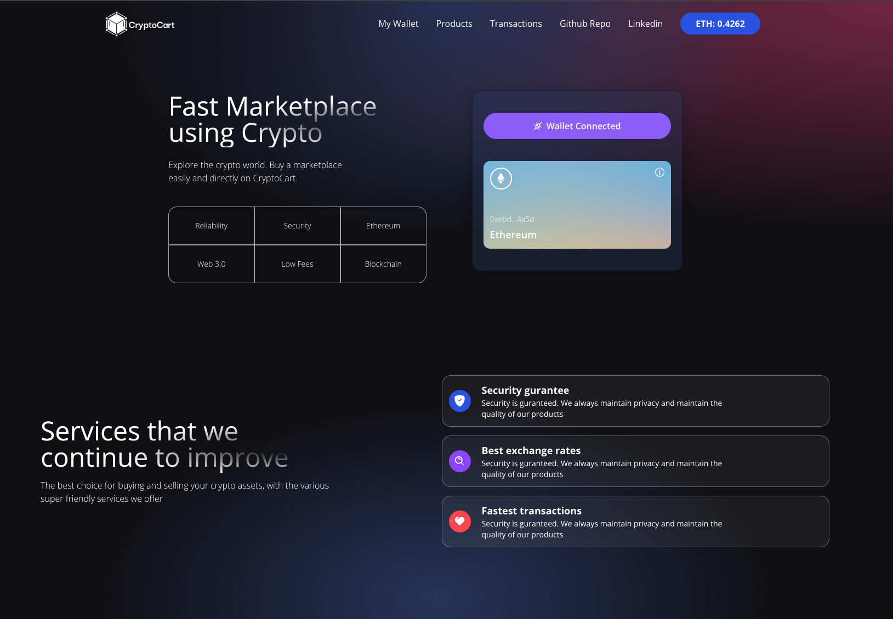
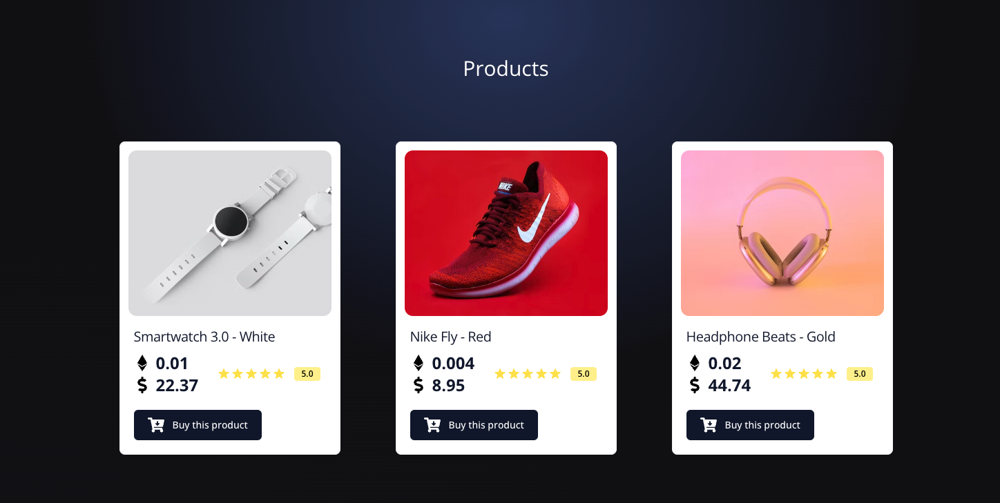
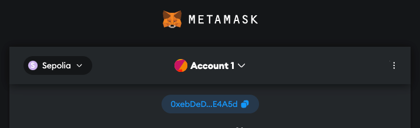

<picture>
  <source media="(prefers-color-scheme: dark)" srcset="https://raw.githubusercontent.com/lucasalvessouza/web3-dapp/main/client/images/logo.png" width="200">
  
</picture>

This is a project focused on Web3 and it's part of studies of DApps.
 
We are simulating a marketplace where the user can buy any products directly with the seller, using Ether as payment method.
The purchase is simulated by a transaction between two accounts.

<b>It's live! You can access [here](https://web3-dapp-psi.vercel.app/)</b>

<b>[Here is a quick video explaning about the application](https://www.loom.com/share/61b00c3fbb6f4c87be290f992223854b?sid=8a1de101-7ac8-4d31-9081-dc4b29718327)</b>

## Good to know
- We are using testnet.
- The seller account is a common account I created to all products. In a real world, would be many products from a different sellers.

Stack: React, Typescript, Solidity, Hardhat, Alchemy, Ether.js, MetaMask.

## How to Use

You must install [MetaMask](https://metamask.io/) and create a wallet. We're using a Sepolia Test Network.

You can use this [Faucet](https://www.infura.io/faucet/sepolia) to get a test ether.

## References
App made based on [Javascript Mastery](https://www.youtube.com/watch?v=Wn_Kb3MR_cU) and general BlockChain studies.

