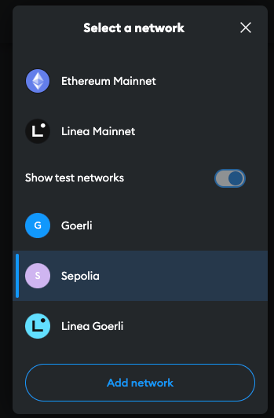

# ReactCoin

This is a project focused on Web3 and it's part of studies of DApps.
 
The first idea is testing a Ethereum transaction between two accounts, using a Smart Contract to make the transactions.

Stack: React, Typescript, Solidity, Hardhat, Alchemy, Ether.js, MetaMask.

## How to Use
You must install [MetaMask](https://metamask.io/) and create a wallet. We're using a Sepolia Test Network.

You can use this [Faucet](https://www.infura.io/faucet/sepolia) to get a test ether.

## References
App made based on [Javascript Mastery](https://www.youtube.com/watch?v=Wn_Kb3MR_cU) and general BlockChain studies.

